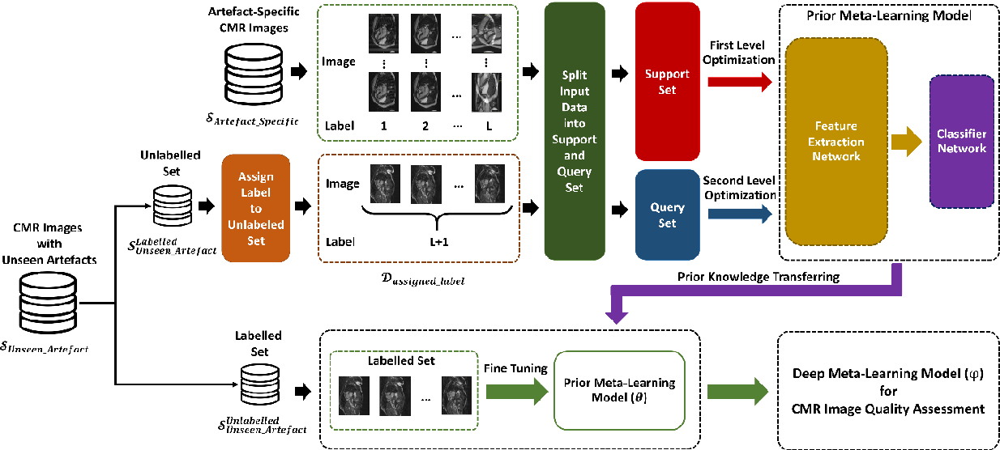

# META-IQA-CMRImages
## This is a pytorch implementation of the paper *[A Generalised Deep Meta-Learning Model for Automated Quality Control of Cardiovascular Magnetic Resonance Images](https://arxiv.org/ftp/arxiv/papers/2303/2303.13324.pdf)*

#### Network Structure

#### Training ( Prior Model )

Then, run `main.py`

#### Evaluation ( Fine Tune Model )
 
Then, run `evaluation.py`

# If you use this code, please cite the following article:

Shahabedin Nabavi, Hossein Simchi, Mohsen Ebrahimi Moghaddam, Ahmad Ali Abin, Alejandro F. Frangi, A Generalised Deep Meta-Learning Model for Automated Quality Control of Cardiovascular Magnetic Resonance Images, Computer Methods and Programs in Biomedicine, 2023, 107770, ISSN 0169-2607, https://doi.org/10.1016/j.cmpb.2023.107770.
(https://www.sciencedirect.com/science/article/pii/S0169260723004364)
